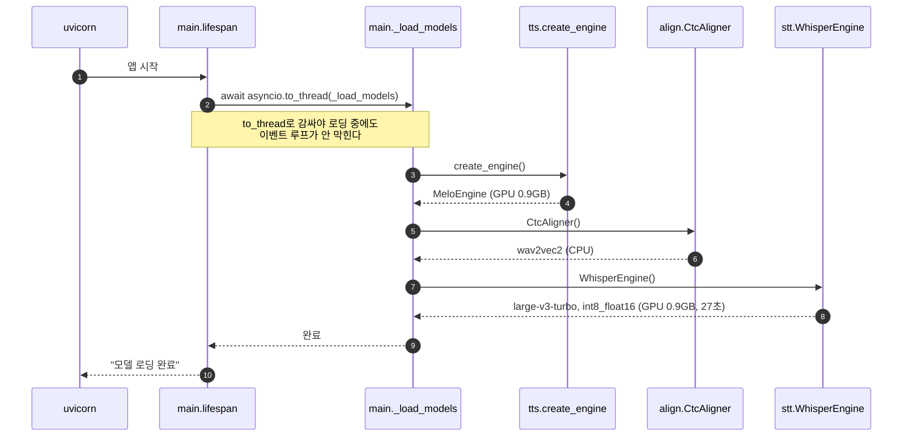
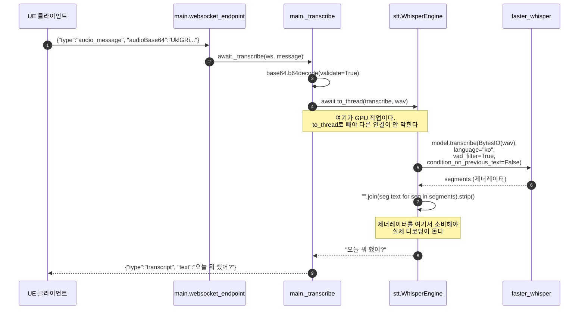
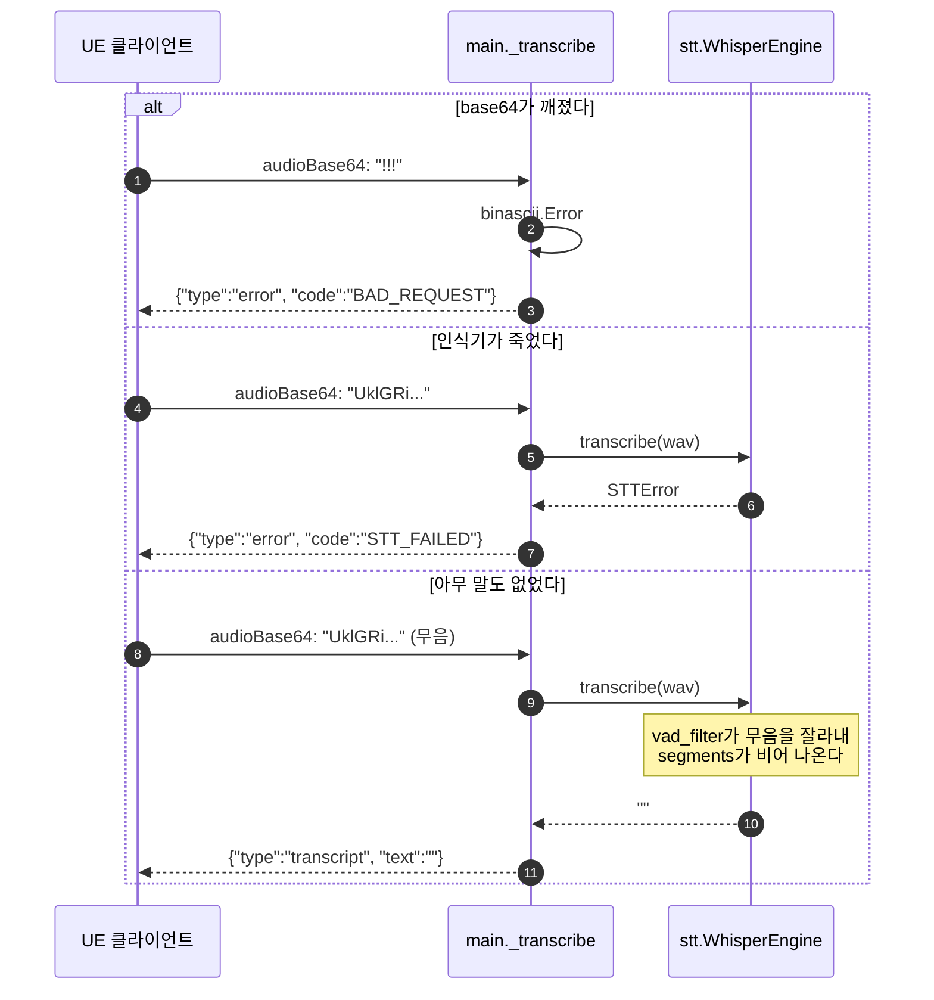
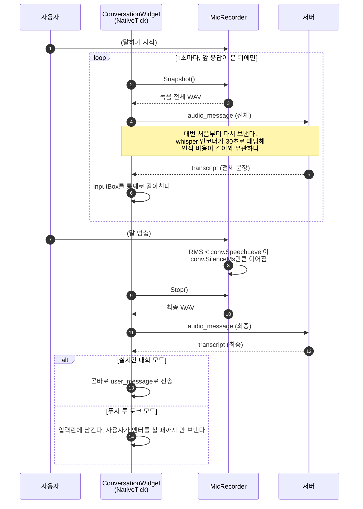
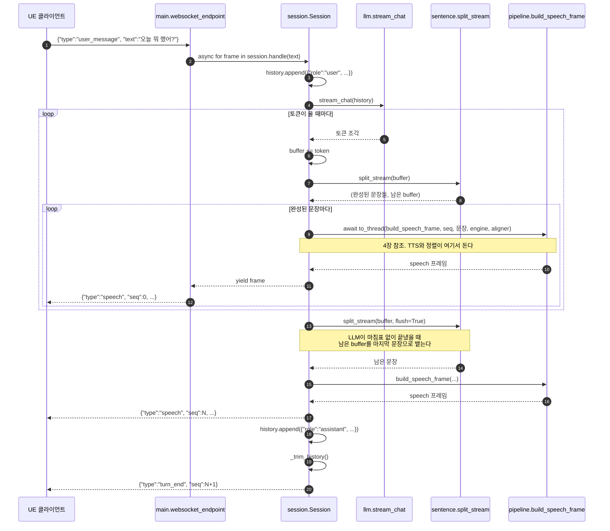
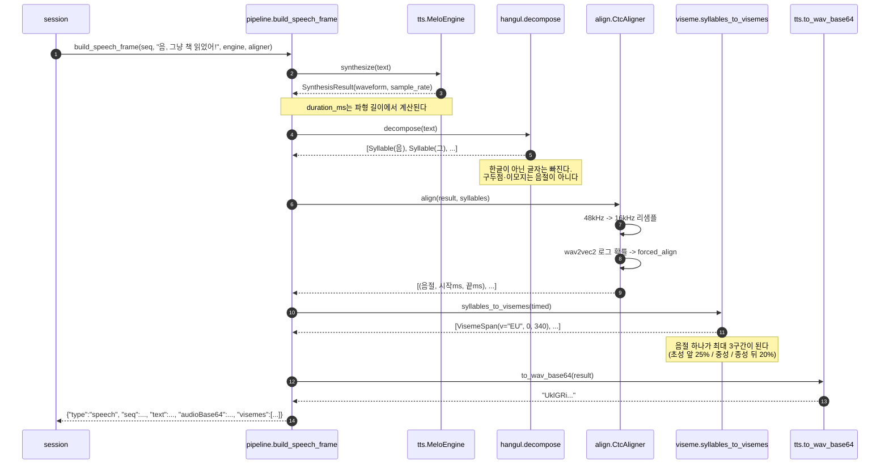
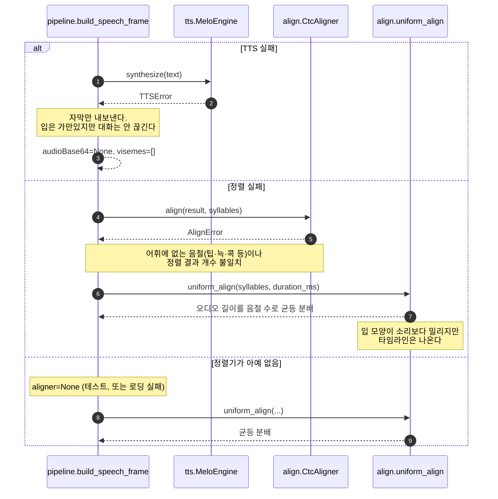
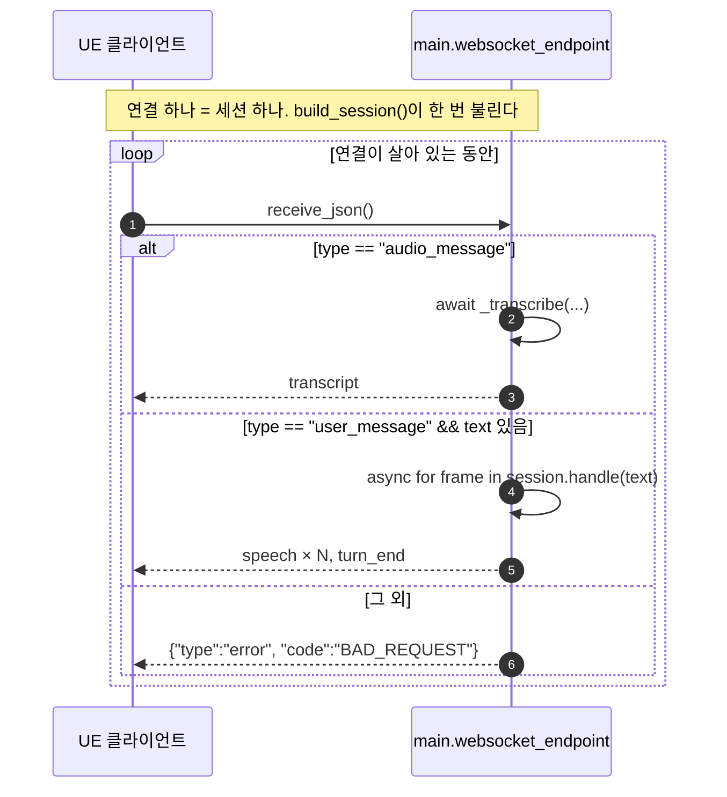

# STT · TTS 시퀀스

서버의 음성 경로를 호출 순서대로 그린다. 전체 구조는 `docs/동작원리.md`에 있다.

두 경로는 **완전히 분리돼 있다.**

| | STT | TTS |
|---|---|---|
| 입력 프레임 | `audio_message` | `user_message` |
| 진입점 | `main._transcribe` | `session.Session.handle` |
| 대화 상태 | 없음 (무상태) | 히스토리에 쌓임 |
| 응답 | `transcript` 1개 | `speech` N개 + `turn_end` 1개 |
| LLM | 안 부름 | 부름 |

---

## 1. 모델 로딩 (기동 시 1회)

셋 다 모듈 전역(`_engine`, `_aligner`, `_stt`)에 담긴다. 프로세스 수명 동안 한 번만
만들고 모든 연결이 공유한다.

`_load_models()`는 멱등이다. `build_session()`과 `build_stt()`가 매번 부르지만 이미
만들어져 있으면 그냥 지나간다.

---

## 2. STT — 받아적기 한 번

**턴을 돌리지 않는다.** 히스토리도 안 건드리고 LLM도 안 부른다. 받아적은 글자는
클라이언트 입력란에 들어가고, 보낼지는 사용자가 정한다.

그래서 이 경로는 완전히 무상태다. 연결마다 오디오 버퍼를 들고 있을 필요가 없다.

### 실패 분기

빈 문자열은 오류가 아니다. 이것도 답으로 보내야 클라이언트가 녹음 상태를 푼다.

`vad_filter`가 없으면 whisper는 무음에 학습 데이터의 자막 상투구를 지어낸다
("시청해주셔서 감사합니다").

### 말하는 중 실시간 갱신

앞 요청의 답이 오기 전에는 다음 것을 보내지 않는다(`PendingAudio > 0`이면 건너뛴다).
인식이 느려지면 갱신 간격이 알아서 벌어진다.

---

## 3. TTS — 한 턴 전체

**문장 단위로 자르는 게 체감 속도의 핵심이다.** 답변 전체를 기다리면 5~8초 침묵이
생긴다. 첫 문장만 나오면 바로 말을 시작하므로 2.6초 안에 입이 움직인다.

LLM이 죽으면 문장 루프 전체가 `LLMUnavailable`로 빠져나와
`{"type":"error", "code":"LLM_UNAVAILABLE"}` 하나만 나가고 턴이 끝난다. 서버는 안 죽는다.

---

## 4. TTS — 프레임 하나 만들기

`build_speech_frame`은 동기 함수다. `Session._speech_frame`이 `to_thread`로 감싸
이벤트 루프 밖에서 돌린다.

### 폴백 두 단계

**텍스트가 최소 보장선이다.** 어느 단계가 죽어도 자막은 나간다.

---

## 5. 두 경로가 만나는 곳

한 연결 안에서는 **메시지가 순서대로 처리된다.** `await`로 하나를 끝내야 다음
`receive_json()`으로 간다. 그래서 부분 인식 응답이 최종 인식 응답보다 늦게 도착하는
일은 없다.

연결이 여러 개면 `to_thread`의 스레드풀에서 STT와 TTS가 동시에 GPU를 칠 수 있다.
지금은 클라이언트가 하나라 문제가 안 된다.

`WebSocketDisconnect`가 나면 루프를 빠져나오고 `Session` 객체는 버려진다.
**히스토리도 같이 사라진다** — 연결이 곧 세션이다.
